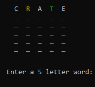
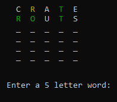
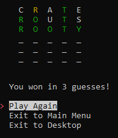
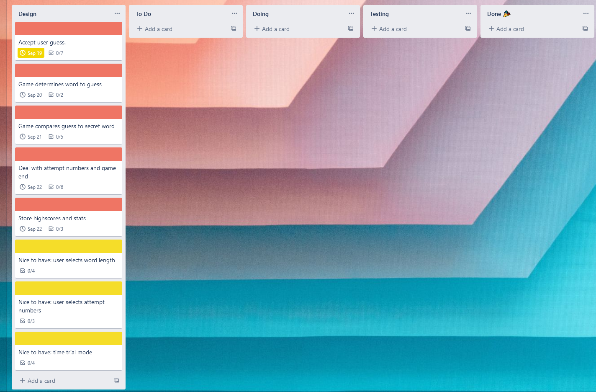
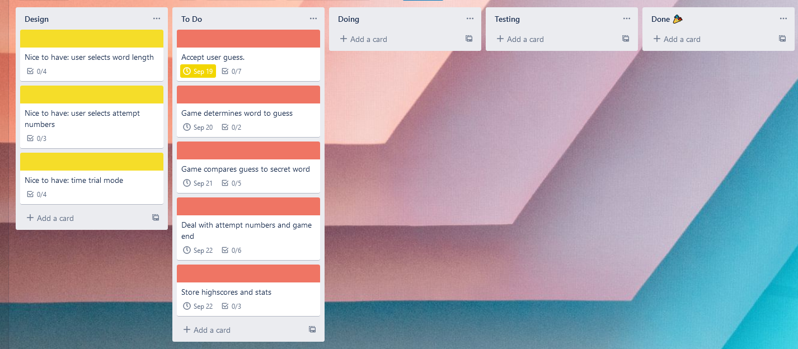
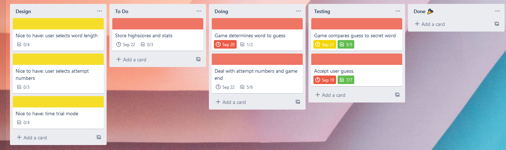
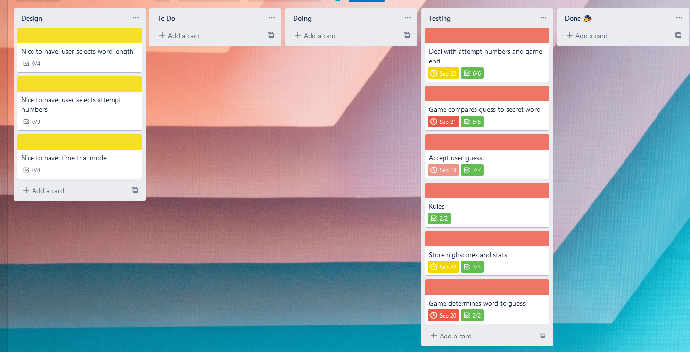
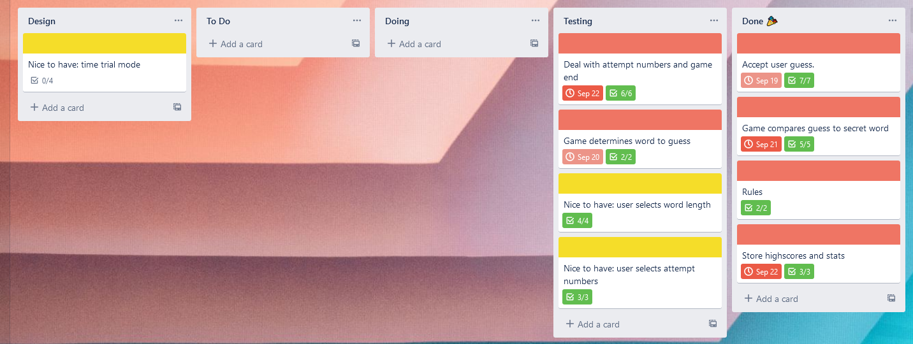
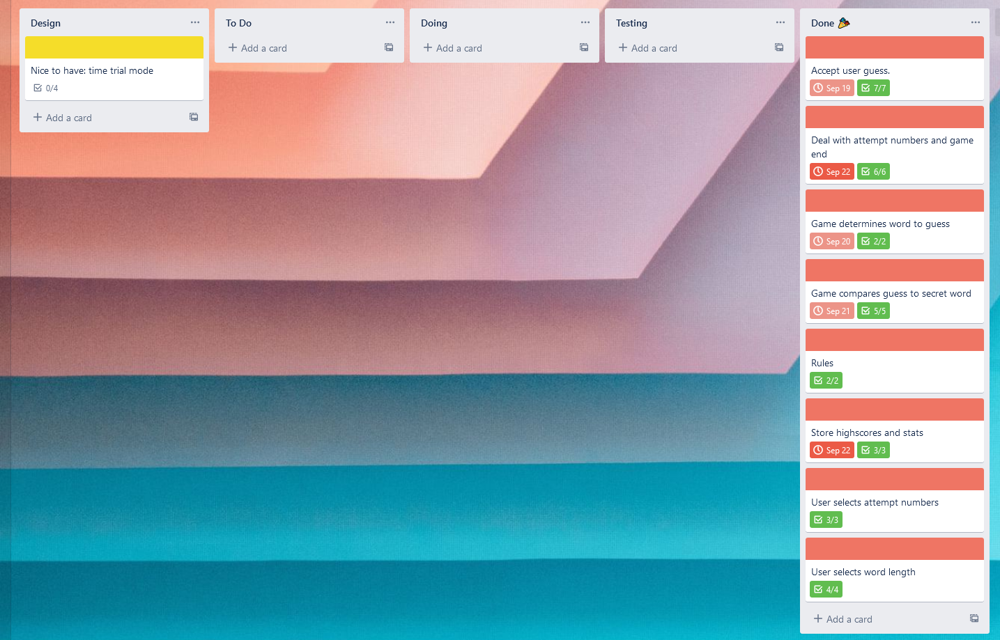

# Welcome to PYWORDLE !

## Table Of Contents

- [Related Documents](#related-documents)
- [Overview](#overview)
- [Features](#features)
- [Gameplay Example](#gameplay-example)
- [Implementation Plan](#implementation-plan)
- [Style Guide](#style-guide)
- [Reference List](#reference-list)

---

## Related Documents

[Slide Deck Presentation](insert link)

[GitHub Repository](https://github.com/CallumRowston/CallumRowston_T1A3)

[Help Document](docs/help.md)

[Trello Workspace](https://trello.com/b/LimXSz09/wordle-app-t1a3)

---

## Overview

PYWORDLE is a terminal based word guessing puzzle game heavily inspired by the New York Times browser based game, Wordle, that became hugely popular in early 2022. It includes a visually informative coloured game board, statistics tracking, menu navigation, and game settings not found in the original Wordle game.

---

## Features

### Coloured Game Board

The main game board features colourised feedback that changes depending on the players guess each round. Just as in the original Wordle game, green letters indicate correct letter in the correct position, yellow letters indicate correct letter but in the wrong position, and white letters indicate the letter is not in the secret word at all. This makes the game visually and logically appealing, and easy to follow as the game progresses

### Default Mode

The default mode randomly selects a secret 5 letter word to be guessed by the player. The user then has 6 attempts to guess the word. After each guess their most recent guess and any previous guesses from the current game are displayed in colour according to the correctness of the players guess.

### Statistics

At the end of each game played with default settings, stats of the game are recorded. The user can then access these stats via the main menu to view their total games played, total games won, win percentage, and their guess distribution - how many times they have taken X amount of guesses to guess the secret word.

### Custom Game Settings

The player can set the secret word length to 5(default), 6, 7 or 8 and the length of the secret word will change to that number. The player can also set the amount of guesses they are allowed per word to 6(default), 7, 8 or 9. The user then is allowed this many guesses at the secret word before they lose. A menu option to reset these settings to default is provided in the game settings menu to easily revert any changes the user has made.

### Menus

Outside of the main gameplay loop, a menu system has been implemented to navigate to dfferent pages; a rules page to explain how to play, a stats page to display the players statistics, a game settings page with further menus to input settings, and a quit option to exit the application

---

## Gameplay Example

### Round 1

### Round 2

### Round 3

---

## Implementation Plan

[Open Trello Workspace](https://trello.com/b/LimXSz09/wordle-app-t1a3)

Trello was used to track and manage the status of tasks required to develop this application. Each feature is listed below in order of development along with a checklist of requirements to implement it. 

### Default Mode

- Have the game select a random word from a list of words
- Take user input as a guess and check it is valid (is an actual word, is 5 letters)
- Handle any exceptions if the guess is not valid and prompt the user to guess again.
- Compare the user guess to the secret word and mark letters accordingly
- Print this output to the terminal
- Prompt the user to guess again
- If the user guessed it, say they won
- If the user ran out of guessses, say they lost
- Provide an option to play again

### Coloured Game Board

- Use the markings attached to each letter in the players guess to colour the output in the terminal
- Correct letters, correct position marked green
- Correct letters, wrong position marked yellow
- Incorrect letters not coloured
- Ensure letters that appear once in the secret word but twice in the users guess are only coloured once in the terminal output

###  Statistics 

- Create a JSON file formatted to accept the required statistics
- At game end, store the gueeses taken, if the game was won and add 1 to total games played
- Update the JSON file with these stats
- Create a way for the user to view the stats - print the JSON file formatted neatly
- Inform the user stats are only tracked in games with default settings

### Custom Game Settings

- Ensure the default mode works if the secret word length is longer or the total guesses allowed is longer
- Provide the user a way to enter input to change the word lenght or total guesses values
- Handle any exceptions relating to the user input
- Provide a way for the user to reset these values
- Display the changed values
- Make obvious to the user that the statistics feature is turned off if they are not playing with default settings

### Menus

- Allow navigation between different features
- Add menu option to play the main game
- Add rules menu option to link to a static page explaining rules
- Add stats menu option to link to a static page displaying the stats
- Add game settings menu option to go to custom game settings feature
- Add sub menu options to return to the mian menu
- Add menu option to quit the application

The Trello Workspace changed throughout the week as these tasks were completed. This can be seen below:

### Sunday

### Monday

### Tuesday

### Wednesday

### Thursday

### Friday

---

## Testing

This application was tested using unit testing implemented through the pytest module. Two highly important functions were tested this way:

- `validate_user_guess` -  A method of the WordleLogic class that checks the users guess is the correct length and is an actual valid word. Tests include checking the correct exceptions are raised under the correct circumstances and if no exceptions are raised, testing that the relevant instance attributes are adjusted as expected.
- `compare_user_guess` -  A method of the WordleLogic class that checks the user guess against the secret word. Tests include checking that each letter of the user guess is marked correctly in relation to the secret word, so that correct letters are marked 'green', partially correct letters are marked 'yellow' and incorrect letters are not marked.

These tests can be found in `src/test_wordle_logic.py`

A broader array of manual testing was performed over the entire terminal application as outlined in the table below.

|Test  |Expected Outcome   |Test Outcome   |
|----|----|----|
|Test when user guesses 'crate' and the secret word is 'CRATE'|The word 'CRATE' is printed in green and the game condition user_wins will return True    |As expected    |
|Test when user guesses 'crate' and the secret word is 'CRANE'|The letters 'C', 'R', 'A' and 'E' will be printed in green and 'T' will be printed in white in order C-R-A-N-E    |As expected    |
|Test when user has remaining guesses|A new line with underscores for the amount of letters in the word is printed below the users most recent guess    |As expected    |
|Test when user_wins returns True |Print the user wins and number of guesses and end_menu() will be called to allow the user to play again or exit    |As expected    |
|Test when user_loses returns True |Print the user loses and end menu() will be called to allow the user to play again or exit   |As expected   |
|Test when user_wins or user_loses returns True and game_is_default returns True    |add_game_stats() will be called and correctly update stats.json    |As expected    |
|Test when user accesses stats menu    |Displays cumulative stats from current and previous sessions and return menu    |As expected    |
|Test when user accesses rules menu    |Displays rules with correct formatting and return menu    |As expected     |
|Test when user selects Quit or Exit to desktop from a menu    |Game prints that it is quitting and the application terminates    |As expected    |
|Test when user selects Back To Main Menu from a menu    |Game returns to the main menu    |As expected    |
|Test when user accesses game settings menu    |Displays current settings, warning, and second menu to change settings    |As expected    |
|Test when user selects Set Word Length menu option and enters 8    |Global variable WORD_LENGTH_SETTING is set to 8    |As expected    |
|Test when user selects Set Word Length menu option and enters 9    |RangeError is raised and user prompted to try again    |As expected    |
|Test when user selects Set Word Length menu option and enters 'nothing'    |ValueError is raised and user prompted to try again    |As expected    |
|Test when user selects Set Word Length menu option and enters 'back'     |The application returns to the game settings menu    |As expected    |
|Test when user selects Set Total Guesses menu option and enters 9    |Global variable TOTAL_GUESSES_SETTING is set to 9    |As expected    |
|Test when user selects Set Total Guesses menu option and enters 10    |RangeError is raised and user prompted to try again    |As expected    |
|Test when user selects Set Total Guesses menu option and enters 'nothing'    |ValueError is raised and user prompted to try again    |As expected    |
|Test when user selects Set Total Guesses menu option and enters 'back'     |The application returns to the game settings menu    |As expected    |
|Test when Reset To Default Settings menu option is selected    |WORD_LENGTH_SETTING is set to 5 and TOTAL_GUESSES_SETTING is set to 6    |As expected    |
|Test when WORD_LENGTH_SETTING is set to 8    |Secret word will be an 8 letter word and the user can only enter 8 letter words    |As expected    |
|Test when TOTAL_GUESSES_SETTING is set to 9    |User is allowed 9 guesses before user_loses returns True    |As expected    |
|Test when WORD_LENGTH_SETTING is set to 6 and TOTAL_GUESSES_SETTING is set to 7    |Secret word will be a 6 letter word and the user can only enter 6 letter words and user is allowed 7 guesses before user_loses returns True    |As expected    |

---

## Installation Instructions

The following instructions are also available [here](docs/help.md)

1. From GitHub, download the [repository](https://github.com/CallumRowston/CallumRowston_T1A3) to your computer.
   Alternatively you can clone the repository by entering the following command in the terminal:

    `git clone https://github.com/CallumRowston/CallumRowston_T1A3.git`

2. Using the terminal, navigate to the `src` folder from where you have saved or cloned the repository by entering:

    `cd CallumRowston_T1A3/src`

3. Enter the following command to check and install all required dependencies and start the application:

    `source run_wordle.sh`

---

## Style Guide

This code conforms to the [PEP 8 Style Guide For Python Code](https://peps.python.org/pep-0008/).

---

## Reference List

Terminal Application idea heavily influenced by Wordle, created by Josh Wardle. Original game accessed at: https://www.nytimes.com/games/wordle/index.html

5 letter word list. Stanford University Computer Science Faculty. Accessed: https://www-cs-faculty.stanford.edu/~knuth/sgb-words.txt

6 letter word list. TheFreeDictionary by Farlex. Accessed: https://www.thefreedictionary.com/6-letter-words.htm

7 letter word list. TheFreeDictionary by Farlex. Accessed: https://www.thefreedictionary.com/7-letter-words.htm

8 letter word list. TheFreeDictionary by Farlex. Accessed: https://www.thefreedictionary.com/8-letter-words.htm
