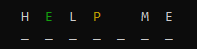

## Installation Instructions

1. From the [GitHub repository](https://github.com/CallumRowston/CallumRowston_T1A3), download the source files to your computer.
   Alternatively you can clone the repository by entering the following command in the terminal:

    `git clone https://github.com/CallumRowston/CallumRowston_T1A3.git`

2. Using the terminal, navigate to the `src` folder from the directory where you have saved or cloned the repository by entering:

    `cd CallumRowston_T1A3/src`

3. Enter the following command to check and install all required dependencies and start the application:

    `source run_wordle.sh`

## Dependencies

+ Python3
+ Pip
+ Third Party Python Packages
  
  + [Colorama](https://pypi.org/project/colorama/)
  + [Simple Terminal Menu](https://pypi.org/project/simple-term-menu/)
